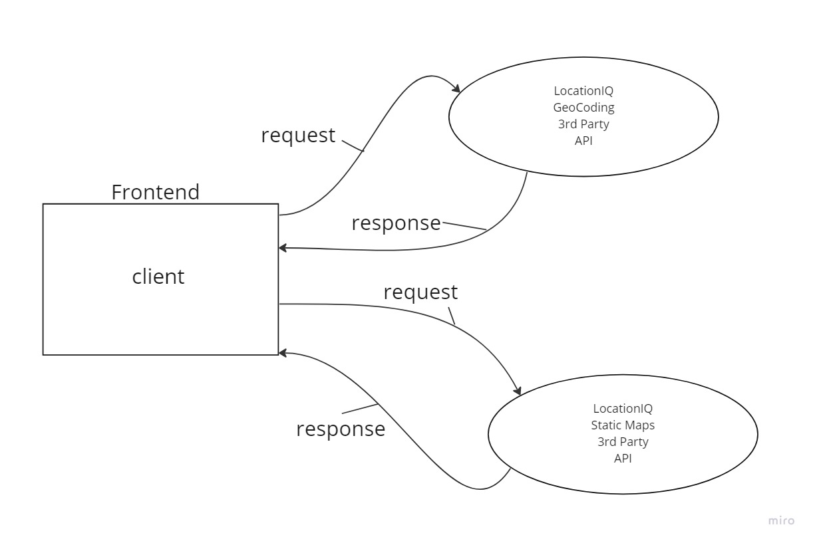
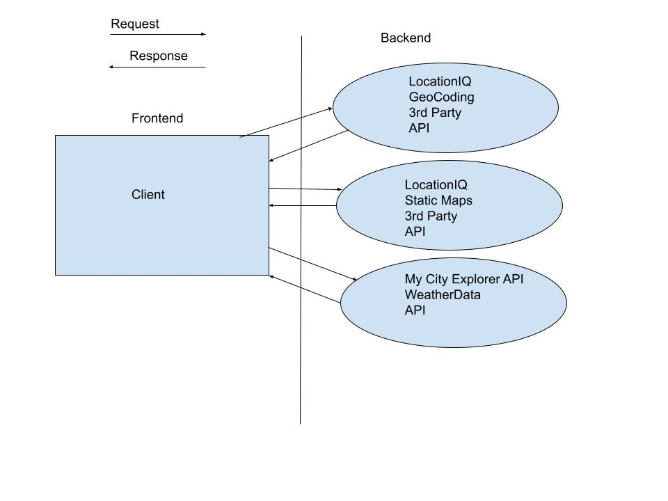
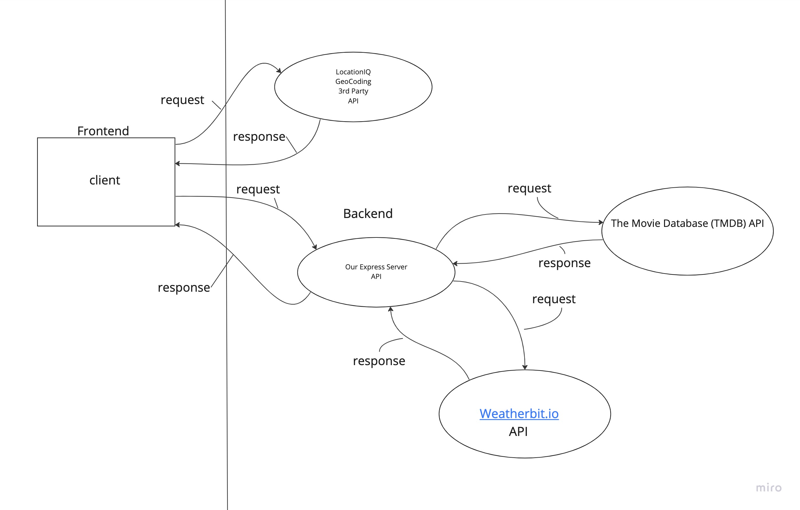
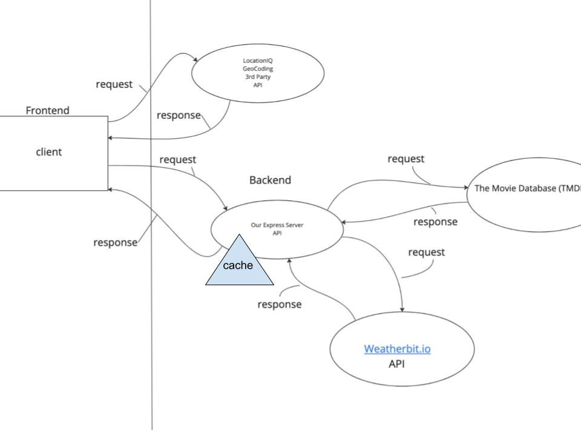

# City Explorer

**Author**: Seth Pierce
**Version**: 1.0.0

## Overview
<!-- Provide a high level overview of what this application is and why you are building it, beyond the fact that it's an assignment for this class. (i.e. What's your problem domain?) -->
This application allows users to search for cities and it displays the city's name, latitude, longititude, and a map of the city.

## Getting Started
<!-- What are the steps that a user must take in order to build this app on their own machine and get it running? -->
The user must create a react app, install axios, install react-bootstrap, and have their own LocationIQ access key to be able to get started to build the app.

## Architecture
<!-- Provide a detailed description of the application design. What technologies (languages, libraries, etc) you're using, and any other relevant design information. -->

I am using Javascript, React, React-bootstrap, Axios, and CSS to build this application.

## Change Log
<!-- Use this area to document the iterative changes made to your application as each feature is successfully implemented. Use time stamps. Here's an example:

01-01-2001 4:59pm - Application now has a fully-functional express server, with a GET route for the location resource. -->

10-24-2022 7:33 pm EST - Application now has a get route to LocationIQ geocoding and LocationIQ static maps. User can now enter a city name and get it's name, latitude, longititude, and a static map of the city.

10-26-2022 10:30AM EST - Application now has a get route to my city-explorer-api and can pull and display weather data for certain cities, displays error when weather data is not available for city.

10-26-2022 8:30PM EST = Application now has a get route to my city-explorer-api and can pull weather and movie data for cities.

10-27-2022 4PM EST - Refactored

## Credit and Collaborations

Steven Rejdukowski - collaborated to create our web request-response cycle.

## Web Request-Response cycle

## Feature Tasks

### Name of feature: Display Name and Map or Error Message

Estimate of time needed to complete: 2 hours

Start time: 4:30pm EST

Finish time: 7:00pm EST

Actual time needed to complete: 2 and a half hours

### Name of feature: Weather Data

Estimate of time needed to complete: 2 Hours

Start time: 12:00AM EST

Finish time: 1:30AM EST

Actual time needed to complete: One and a half hours

### Name of feature: Movie Data

Estimate of time needed to complete: 2 Hours

Start time: 4PM EST

Finish time: 7PM EST

Actual time needed to complete: Three Hours

## Name of feature: Refactoring

Estimate of time needed to complete: 45 minutes

Start time: 3PM EST

Finish time: 3:45PM EST

Actual time needed to complete: 45 minutes
